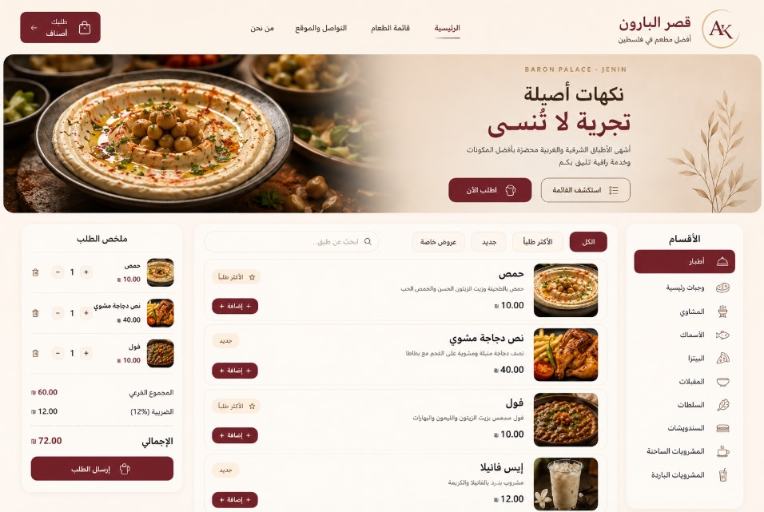

# 🍽️ Restaurant Ordering & Management System

A real-time restaurant ordering and management system that connects customers, kitchen staff, cashiers, and administrators through one integrated workflow.



---

## 📖 Project Overview

The **Restaurant Ordering & Management System** is a digital restaurant solution designed to streamline table ordering and internal order handling.

Customers can browse the digital menu, add items to their order, select their table, and send the order directly to the restaurant. Kitchen staff receive active orders on a dedicated kitchen display, while the cashier can monitor open table bills and close them after payment.

The system also includes an administration interface for managing menu categories, products, restaurant information, and other operational content.

Real-time data synchronization is handled using **Supabase**.

---

## ✨ Key Features

### 📱 Customer Digital Menu

- Responsive digital menu
- Category-based product browsing
- Product images, descriptions, and prices
- Search and filter options
- Shopping cart
- Quantity management
- Table-number selection
- Order notes
- Direct order submission
- Responsive desktop and mobile experience

### 👨‍🍳 Kitchen Display System

- Live incoming orders
- Table number and order details
- Order status workflow
- Start preparing orders
- Mark orders as ready
- Mark orders as delivered
- Print order tickets
- Active-order monitoring

### 💳 Cashier & Table Management

- View open orders by table
- Track each table's running total
- Monitor active table bills
- Close bills after payment
- Clear completed table orders

### ⚙️ Admin Dashboard

- Menu category management
- Product management
- Product details and pricing
- Restaurant information management
- Digital menu content control
- Centralized system configuration

---

## 🔄 System Workflow

```text
Customer
   ↓
Digital Menu
   ↓
Select Items + Table Number
   ↓
Submit Order
   ↓
Supabase
   ↓
Kitchen Display
   ↓
Preparing → Ready → Delivered
   ↓
Cashier
   ↓
Payment & Table Checkout
```

This workflow allows the restaurant team to manage the complete order lifecycle from the customer's table to the kitchen and cashier.

---

## 🗄️ Backend & Real-Time Data

The project uses **Supabase** for:

- Cloud database integration
- Real-time order synchronization
- Menu and category data
- Table orders
- Order status updates
- Restaurant configuration data

SQL setup files are included in:

```text
supabase/
```

---

## 🛠️ Technologies

- HTML5
- CSS3
- JavaScript
- Supabase
- PostgreSQL
- Real-Time Database Updates
- Responsive Web Design

---

## 📂 Project Structure

```text
Restaurant-Ordering-Management-System/
│
├── assets/
│   ├── admin.js
│   ├── cash.js
│   ├── common.js
│   ├── kitchen.js
│   ├── menu.js
│   ├── styles.css
│   └── ...
│
├── supabase/
│   ├── setup.sql
│   └── sample-data.sql
│
├── Images/
│   └── restaurant-preview.jpg
│
├── index.html
├── kitchen.html
├── cash.html
├── admin.html
├── config.js
├── config.example.js
├── .gitignore
└── README.md
```

---

## 🚀 Setup

1. Create a Supabase project.

2. Run:

```text
supabase/setup.sql
```

in the Supabase SQL Editor.

3. Optionally load:

```text
supabase/sample-data.sql
```

for demo data.

4. Update the placeholder values inside:

```text
config.js
```

with your own restaurant and Supabase settings.

5. Open:

```text
index.html
```

locally or deploy the project to a static hosting provider.

---

## 🔐 Security Note

This portfolio version does not contain production Supabase credentials or private client information.

Do not commit private keys, service-role keys, passwords, or production secrets to GitHub.

---

## 🎯 Project Purpose

The project demonstrates the design of a complete restaurant workflow that integrates a customer ordering interface with kitchen operations, cashier table management, and administration tools.

It focuses on real-time order handling, responsive user interfaces, operational workflow design, and cloud database integration.

---

## 📸 Project Preview


---

## 👩‍💻 Developer

**Aya Khamaysa**

Computer Systems Engineering  
Arab American University
